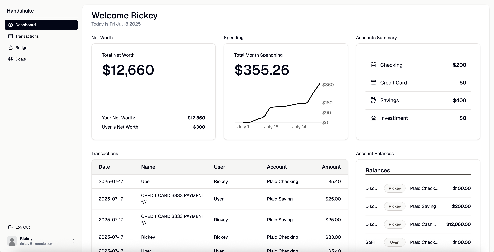
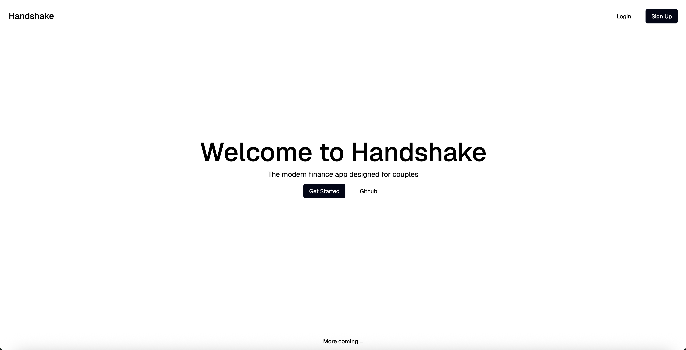
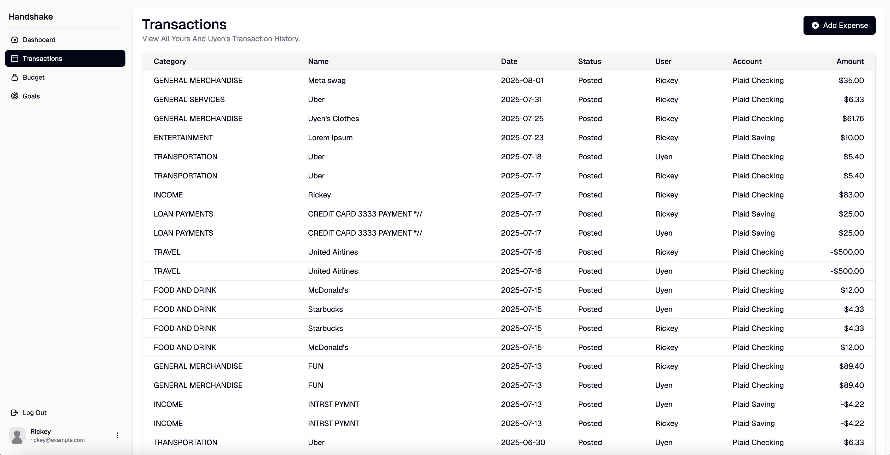
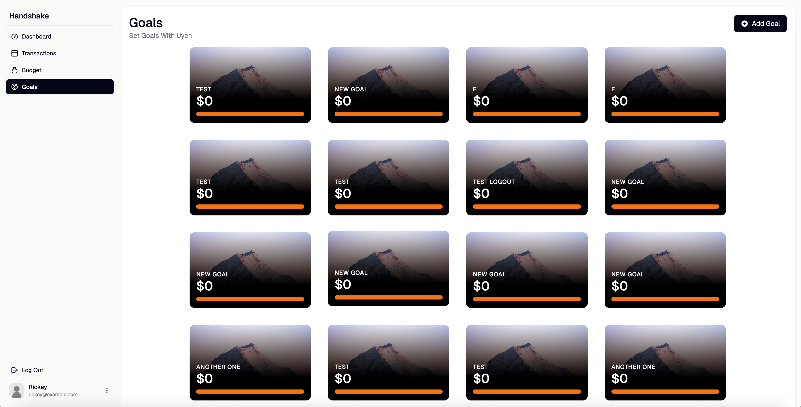
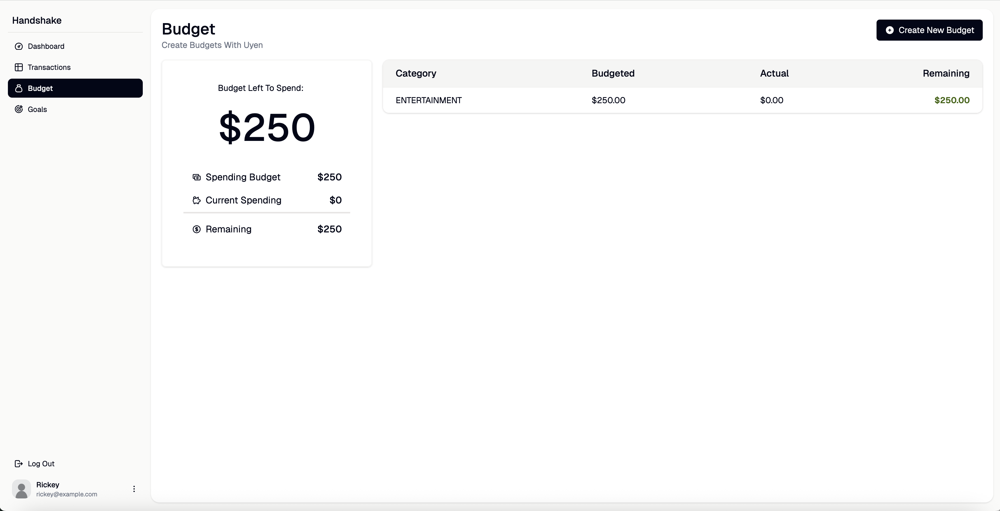

# Handshake

**A modern finance app designed for couples to manage money—together.**

  

## 🔗 Live Site

👉 [Visit Handshake](https://your-deployed-site.com)

## 📌 Overview

Handshake is a modern shared finance application designed for couples who want full transparency, collaborative money management, and personalized financial insights — all while preserving individual autonomy and control over their own accounts. Whether you're splitting bills, saving for a trip, or working toward shared goals, Handshake empowers partners to build healthy financial habits together without compromising independence.

**Core idea:**  
Each user links their own bank accounts via Plaid, and Handshake aggregates, organizes, and visualizes shared financial data through one clean, interactive dashboard.

**Use cases include:**

-   Tracking spending habits together
-   Setting up shared budgets
-   Saving toward financial goals as a team
-   Managing expenses visually with receipt uploads
-   Seeing real-time updates across devices

## 🧠 Key Features

### 🧾 Receipt OCR (Optical Character Recognition)

-   Upload or snap a photo of a receipt
-   Automatically extracts all monetary values using **Tesseract.js**
-   Draws interactive bounding boxes on the receipt
-   Tap or click a box to auto-fill the expense form

### 🔁 Real-Time Cross-User Sync

-   WebSocket-powered dashboard
-   Budget, transaction, and goal updates reflect instantly on your partner’s screen
-   Designed for collaborative financial decision-making without needing a refresh

### 💳 Bank Account Integration via Plaid

-   Users securely link their financial accounts
-   Choose which accounts (checking, savings, credit, etc.) to share
-   Pull in live balances, transactions, and account metadata

### 🧾 Expense Tracking & Categorization

-   Filterable transaction table with inline editing
-   Transactions auto-categorized or manually tagged (e.g., food, travel, shopping)
-   Add manual expenses for offline spending

### 💰 Shared Budgeting

-   Set budgets per category (groceries, dining, shopping, etc.)
-   See budget vs. actual spend in real-time
-   Color-coded budget progress bars

### 🎯 Goal Setting

-   Create shared goals with a target amount and deadline
-   See contribution breakdown by partner
-   Visual progress bars and timeline tracking

### 📊 Shared Dashboard

-   Combined view of accounts, balances, and net worth
-   Transaction summaries by category and time
-   Dynamic graphs for financial insights
-   Calendar view with visual spending indicators

### 🔒 Secure Partner Pairing

-   Generate a one-time pairing code to share with your partner
-   Once accepted, accounts are securely linked
-   Supports safe unpairing and data separation

## 🛠️ Tech Stack

| Layer        | Stack                                         |
| ------------ | --------------------------------------------- |
| **Frontend** | React, TypeScript, Tailwind CSS               |
| **Backend**  | Node.js, Express, Prisma ORM                  |
| **Database** | PostgreSQL                                    |
| **APIs**     | Plaid, Tesseract.js                           |
| **Realtime** | WebSockets                                    |
| **Auth**     | Session-based with `express-session` & bcrypt |

## 🧩 System Architecture

-   **Frontend**

    -   React Context + custom `useUser()` hook manages session state
    -   Protected routes enforced via HOC pattern
    -   Component-driven UI with Tailwind-based design system
    -   Uses canvas and HTML overlay for OCR highlighting

-   **Backend**

    -   REST API built with Express
    -   Session-based auth with secure cookie handling
    -   Prisma ORM models for `User`, `Transaction`, `Goal`, `Budget`, etc.
    -   Secure token exchange and webhooks for Plaid integration

-   **Database**
    -   Postgres schema designed for extensibility and partner-pairing logic
    -   Relationship-aware data models with support for paired users and shared data access
    -   Used Prisma API for database CRUD operations using functions from Prisma API

## 📦 Core API Endpoints

| Method | Endpoint                           | Purpose                     |
| ------ | ---------------------------------- | --------------------------- |
| `POST` | `/api/auth/signup`                 | Create a new user account   |
| `POST` | `/api/auth/login`                  | Log in with email/password  |
| `POST` | `/api/logout`                      | Destroy session             |
| `POST` | `/api/pair/request`                | Generate pairing code       |
| `GET`  | `/api/pair/enter`                  | Accept a pairing invitation |
| `POST` | `/api/plaid/create_link_token`     | Start bank account linking  |
| `POST` | `/api/plaid/exchange_public_token` | Exchange for access token   |
| `GET`  | `/api/plaid/accounts/get`          | List linked bank accounts   |
| `GET`  | `/api/plaid/transactions/sync`     | Pull new transactions       |
| `POST` | `/api/goals`                       | Create savings goal         |
| `POST` | `/api/budgets`                     | Create budget               |
| `POST` | `/api/expenses`                    | Add manual expense          |

> ⚙️ Additional endpoints for updating, deleting, or fetching individual entries exist for each resource.

## 🧪 Technical Challenges

### 1. 🔁 Real-Time Cross-User Sync

-   Updates to expenses, budgets, and goals are reflected immediately across paired sessions using **WebSockets**
-   Reduces latency and supports collaborative decision-making
-   WebSocket server broadcasts updates to all clients within a pair
-   Noitifications displayed across paired users screens to highlight

### 2. 🧾 Intelligent Receipt Scanning (OCR)

-   Users upload or capture receipt images
-   Tesseract.js parses the receipt text
-   App dynamically identifies price-like values and displays them in clickable overlays
-   Selected amount populates the "Add Expense" form automatically

**Project Plan:** [Handshake- Project Plan](https://docs.google.com/document/d/1RWj0f8nT2Vqfz24rBwgXz-8atkTkplsZzBFWUS4pOO4/edit?usp=sharing)

## 🙌 Acknowledgements
-   My Intern Manager, Prashant, my MU peers, my recruiter, and my fellow MU interns for their support and for the amazing summer 

##  📸 Screenshots

  
  
  
  
  

